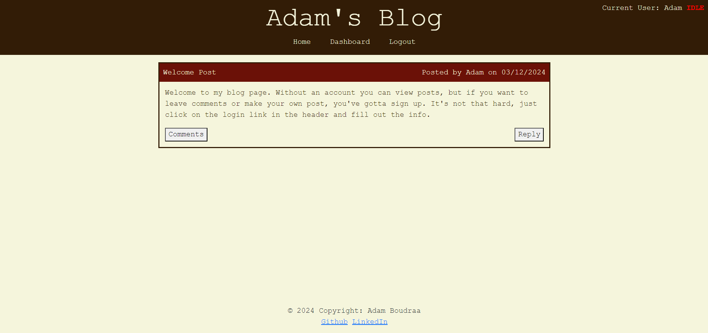

# Boudraa-Blog-Page

## Description
This application is a blogpage. Anyone with an account can make posts or comment on other people's posts, and it will show up on the homepage. You can also modify or delete your posts and comments if you wish to do so.

## Link to deployed site:
https://evening-tundra-87710-7eb66c5c7750.herokuapp.com/ 

## Table of Contents

- [Usage](#usage)

- [License](#license)

- [Questions](#questions)

## Usage
In order to post or comment on this site, you must create an account using your name, email, and a password. However, without an account you can still view existing posts and comments.

## License
This project is licensed under the terms of the MIT License.

## Questions

GitHub: https://github.com/adamboudruh.

Please direct any questions to my email: [adamboudraa@gmail.com](mailto:adamboudraa@gmail.com).

    